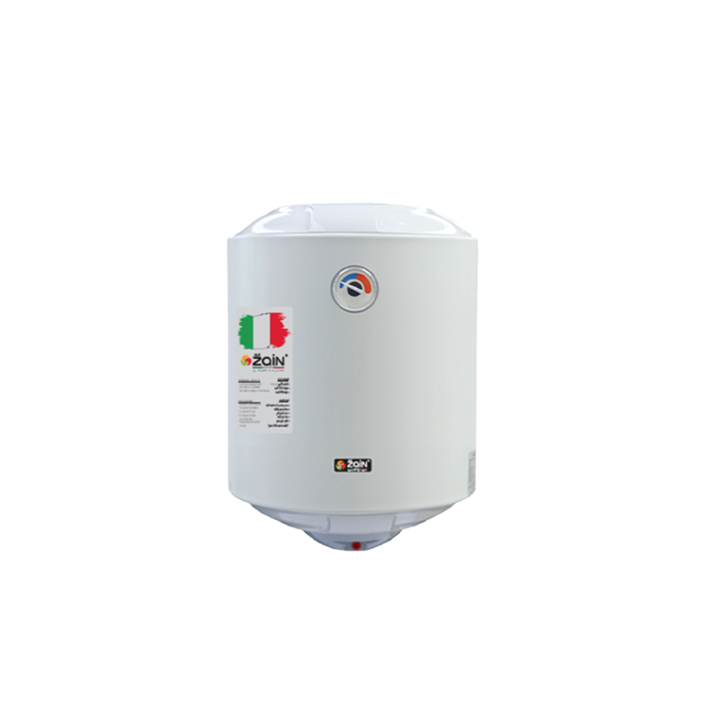

# ZAIN Water Heaters Website
## سخانات زين — العراق

A fully responsive, 3D-animated showcase website for Zain Water Heaters, Baghdad, Iraq.

---

## 📁 Folder Structure

```
zain-website/
├── index.html              ← Main website file (open this)
├── css/
│   └── style.css           ← All styles + animations
├── js/
│   └── main.js             ← All interactivity + product data
├── img/
│   ├── zain/               ← Add ZAIN product images here
│   ├── grohee/             ← Add GROHEE product images here
│   ├── bg/                 ← Add background/slideshow images here
│   └── icons/              ← Brand logos, icons
└── README.md
```

---

## 🛠 How to Use

### Open the website
Simply open `index.html` in any modern browser. No server needed.

### Add Product Images
Place product images in the correct folder:
- `img/zain/` → for Zain products
- `img/grohee/` → for Grohee products

**Recommended naming convention:**
- `zain-vertical-50.png`
- `zain-horizontal-80.png`
- `grohee-vertical-100.png`
- `grohee-ceiling-50.png`

To use your images, in `js/main.js` find the `buildProductCards()` function and replace the SVG placeholder with:
```html

```

### Add Background Slideshow Images
Place landscape/environment photos in `img/bg/` and update the `.slide` classes in `index.html`:
```css
.slide-1 { background-image: url('img/bg/hero-1.jpg'); }
.slide-2 { background-image: url('img/bg/hero-2.jpg'); }
```

### Update Contact Info
In `index.html`, find the `#location` section and update:
- Address
- Phone number
- Email
- Google Maps embed

### Embed Google Maps
Replace the `.map-placeholder` div with your Google Maps iframe:
```html
<iframe
  src="https://www.google.com/maps/embed?pb=..."
  width="100%" height="400"
  style="border:0" allowfullscreen loading="lazy">
</iframe>
```

---

## ✨ Features

- **Custom animated 3D water heater** — canvas-rendered with glow effects
- **Particle field** — 120 animated particles in hero
- **Slideshow background** — 3 cycling gradient slides (replace with photos)
- **Product catalogue** — 23 products across Zain and Grohee
- **Filter system** — by brand, orientation (vertical/horizontal/ceiling)
- **Product detail modal** — click any product card for specs
- **Counter animation** — stats count up on scroll
- **Scroll reveal** — elements animate in on scroll
- **Custom cursor** — glowing cyan dot + ring
- **Responsive** — mobile, tablet, desktop optimized
- **Arabic + English** — bilingual throughout

---

## 📦 Products Included

### ZAIN (مغلون) — 14 products
| Size | Vertical | Horizontal (Wall) |
|------|----------|-------------------|
| 50L  | ✓ | ✓ |
| 80L  | ✓ | ✓ |
| 100L | ✓ | ✓ |
| 120L | ✓ | ✓ |
| 160L | ✓ | ✓ |
| 200L | ✓ | ✓ |
| 250L | ✓ | ✓ |

### GROHEE (مزجج) — 9 products
| Size | Vertical | Horizontal | Ceiling |
|------|----------|------------|---------|
| 50L  | ✓ | ✓ | ✓ |
| 80L  | ✓ | ✓ | ✓ |
| 100L | ✓ | ✓ | ✓ |

---

## 🎨 Brand Colors
- ZAIN: `#00c8ff` (cyan)
- GROHEE: `#00e5a0` (green)
- Background: `#0a1628` (deep navy)

---

## 🌐 Browser Support
Chrome, Firefox, Safari, Edge (all modern versions)

---

*Built for Zain Water Heaters, Baghdad, Iraq — 2025*
